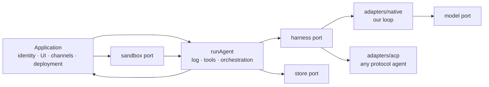

# ARCHITECTURE — how the system works and who owns each part

## Shape



## State

There is one state class: **the session log** — the ordered entries of what happened. It is not a
record of state kept elsewhere; the loop projects its context from it every turn and appends its
results back, which is why no test has to prove two representations agree.

A store persists the log and answers one more question: what work is owed. Undelivered input makes a
session runnable. Those commit together — a run's terminal entry and the input it hands to another
session are one write, which is what makes a handoff between agents safe.

Transport delivery is not state. Whether a Slack message or browser connection received an entry is
the application's bookkeeping. aglib supplies ordered entries and a cursor.

## The four ports

Each is `<port>.ts` beside `adapters/`. None imports another: a store knows nothing of harnesses, a
harness nothing of stores.

| Port | Answers |
| --- | --- |
| `model` | How do I reach a provider? One streaming method, one model, one credential; a caller wanting the whole response drains it. Choosing a model is choosing a `Model`, never naming one. |
| `store` | Where does the log live, and what is owed? Create, read, append-with-`expectedSeq`, list, next, interrupted, close — and `watch`, where the store has a way to push. |
| `sandbox` | Where do commands run? Isolation is requested and either enforced or refused, and a credential is given as a `Secret` whose fate the sandbox reports. |
| `harness` | How does one activation reason and act? One fact: can it resume from history. |

Some provider responses carry continuation state that must accompany an assistant turn on the next
request: signed thinking blocks, encrypted reasoning, or another wire-native item. The model adapter
keeps those values verbatim as `providerState` on the assistant entry, tagged by the provider wire
that produced them. The projection carries the state beside the message, and only an adapter with
the matching tag puts it back on its wire. It is neither assistant content nor a reasoning delta, so
persisting it does not turn private or encrypted reasoning into text a person or another model sees.
When a wire exposes only plaintext reasoning for continuation, that plaintext is necessarily part
of the durable state; an application with stricter retention requirements must configure the
provider not to return it. aglib does not copy it into content or render it as conversation text.

**One fact, not eight.** A caller only ever needs to know whether an interrupted activation can
restart from the log, and `run.ts` is the consumer — it closes a session no harness can continue
rather than handing it out for ever. Everything a larger capability matrix carried was optional
output, another subsystem, or a question nobody asked.

There were two until recently. `toolUse` claimed to say whose tools ran, and it went because it
answered none of the three questions it was conflating — whose tools, whose code, whose authority —
reliably. A harness can run a *vendor's* tools through our executor, and can be handed tools
*we wrote* to reach over a boundary it opens rather than through ours; the table under "What each
route can and cannot do" says both accurately, and nothing branched on the enum. Should authorization provenance ever be needed, it is a fact about
a call and belongs on the tool entry, not back on the harness.

## Concurrency

Two mechanisms, doing two different jobs. They are easy to confuse and this document previously did.

**`expectedSeq` is correctness.** A write from a stale position loses and is told the real one, so
two writers can never interleave at the same position.

**The claim taken by `next` is exclusion.** It stops a second worker starting a *second activation*
of a session that is already running.

Compare-and-swap alone does not give the second property, and an earlier version of this document
claimed it did. Two activations can run concurrently at different positions, each committing
happily, until one loses a race mid-turn. What that produces was observed, not theorised: a message
delivered to a busy session was taken by a second worker, which committed at the position the first
worker was about to use; the first worker's tool result was then refused, leaving a tool call asked
and never answered — a log a provider will not accept.

Two changes fix it, and both are small.

`next` **claims but does not consume.** The queue it reports stays where it is; the append that
commits those inputs as entries is what removes them, in the same compare-and-swap. A worker that
loses therefore leaves the messages exactly as it found them.

`next` **skips a session with an activation already open.** Open-ness is maintained transactionally
from the entries as they commit — `run.started` opens it, `run.finished` closes it — and every write
an open activation makes renews it. `next`'s claim writes the same field, so the two are one fact
rather than two that could disagree.

That renewal is not decoration. Without it the mark stayed at the instant the run began, so any turn
outstanding longer than the claim window was handed to a second worker while the first was still
going — and a compare-and-swap can refuse the losing write, but it cannot un-run a tool call that
already had its effect. A worker that dies still releases its session, because a dead worker stops
writing. What remains is one narrow case: an activation that commits nothing at all for longer than
the window can still be taken, including while a long asynchronous tool is the only work pending.
Set `claimMs` above the longest silent turn or tool duration the deployment permits.

The claim is still deliberately minimal: nothing renews it but the work itself — no heartbeat, no
renewal subsystem, no fencing token. It expires on its own so a worker that dies does not strand a
session, and if that worker is somehow still alive its writes fail the compare-and-swap anyway.
**The claim saves work; the compare-and-swap makes the work safe.**

A third change belongs to the projection rather than the store: an assistant turn holding a call
with no result is closed with an explicit statement that the call did not report back. Some
activation will always end between asking and answering — cancelled, interrupted, killed — and a
session that cannot be projected is a session that is permanently stuck.

## Resumption

`next` answers one question — *what has been asked for* — and it is the right question almost
always. There is a second, and until a store could answer it the log's whole reason for existing had
a hole in the middle: *what was being worked when a process stopped existing.*

Nothing else can see that session. It is open, so `next` skips it by design; and the queue that made
it runnable was consumed by the commit that recorded it, so nothing is owed to it either. A worker
killed mid-run therefore leaves a conversation that waits for a stranger to speak to it — while the
committed entries that would let it be finished sit right there. Every application built on this
rediscovers it and writes the same query.

`interrupted` is that query: an open run whose claim has lapsed, with nothing waiting. It claims on the
same terms as `next` and reports the same shape with an empty queue. It is a separate method rather
than a mode of `next` because finishing interrupted work is a decision — an application may want it
picked up at once, or left until whoever cares speaks next — and because a caller that asked for
work would otherwise silently be handed a resumption instead.

The activation that follows is given the claim whole, and a claim with an empty queue **is** the
resumption. Its input is already an entry, so replaying it would begin the same conversation twice;
the loop reads the history it was handed, sees the tool call that already had its effect, and carries
on rather than asking for it again. Only a harness declaring `recovery: "history"` is offered this.

A harness declaring `"none"` **ends** the run it was handed. It commits `run.finished` with a
`no-recovery` failure for the interrupted activation and fires `beforeStop`, so a parent waiting
on that session hears the dead end rather than waiting on it. Refusing without writing is the
obvious thing and it is wrong: the harness is a property of the session, so nothing else was going
to continue that activation either, and leaving it open means `interrupted` hands the same session back
every claim window for ever — to a worker that has already provisioned a sandbox to receive it.

Passing the claim whole is the other half. A worker used to line up the session, the position and how
many deliveries to consume as three separate fields, and every one of them was a field of the claim —
`takePending` was only ever `claim.pending.length`. Both applications written on this wrote the same
eight lines to get it right, and forgetting the last of them leaves the input queued for ever. The
fields are gone; there is one value, and it arrived from the store already consistent.

## Being told to look again

`next` and `interrupted` answer when asked. Neither gives a caller a way to *wait*, so every
application built on this invents one, and the cheap invention is a timer: our own service asked
twice a second, for ever, and a message still waited up to half of that. The interval is the whole of
a delivery's latency, which makes every place a message can land arrive one poll later than it says.

`watch` is the other half, and it is deliberately the smallest thing that can be: an interrupt line.
A wake carries which session moved and whether it now has work owed, and nothing else — a watcher
cannot read state from it and must not try. That is what makes it safe to be wrong about. A spurious
wake costs one query; a lost wake costs the heartbeat rather than the work; several changes may
arrive as one. **A caller keeps its heartbeat.** The feed removes latency, not the need to look.

Two things it must get right, and both were got wrong in practice:

- **After, never before.** A watcher is woken only once the change is readable, or it looks, finds
  nothing, and is never told again.
- **Its own writes count.** A change committed through a store wakes that store's watchers even when
  the writer and the reader are the same process. An implementation skipped its own notification to
  avoid an echo — and since the surface that writes and the worker that reads were one process, a
  delivery woke nobody and sat out the heartbeat.

It is the one optional method on the port, and honestly so: a store reached over a channel with no
push cannot offer it. How far a feed reaches is the store's own to state, and the conformance subject
is where it states it — `process` or `deployment`, and a feed claiming the second is made to prove
that a write on one connection wakes a watcher on another. The sqlite store watches its own instance,
which is where the surface and the workers usually sit; the Postgres store holds a `LISTEN`
connection and reaches every process on the database, because that is the store you choose when there
is more than one.

## Messaging

One append may deliver to several sessions. Each recipient keeps its own delivery identity and queue: consuming one recipient's input does not consume another's, and a retry does not redeliver to either. If any recipient is missing, neither the sender's entries nor any recipient's input commits. Applications can compose shared conversations from these deliveries without giving the library a participant graph.

One session delivering input to another is `append({ entries, enqueue })`: what the sender did and
what the recipient receives commit together, or neither happens. Spawning a child, replying to a
parent and messaging a peer are all this one operation, which is why there is no separate mailbox,
bus or inbox table.

A tool executor reports one completed call at a time. Each completion carries only the deliveries
that call produced, and the harness commits that result with those deliveries before accepting the
next completion. A quick `send` therefore reaches its recipient while an adjacent slow tool is
still running; a later failure cannot misattribute or erase the earlier delivery. Adjacent
read-only calls may finish out of order. Effectful calls retain their declared order.

A `Delivery` carries four things beyond its content:

| Field | Why it exists |
| --- | --- |
| `sessionId` | Who receives it. |
| `from` | Who sent it: `{ kind, id }`. aglib mints one kind — `"session"` — and interprets no other; every other kind is the application's word for one of its own senders, and only the application can close that list. Absent means the application did not say. Recorded on the receiving `run.started`, so an application can tell a peer's message from its user's, and can see that it already answered one that arrives twice. Whether the model reads it is the recipient agent's `attribution`, and the two are separate: provenance is a fact on the log, a label is text in a prompt, and an application that already names its senders in its own words would be handing the model a second name for one of them. |
| `priority` | Where in the recipient's loop it lands: `interrupt`, `turn`, or `next`. |
| `id` | The sender's key for this delivery, so a retried send does not arrive twice. |

**Three places, not a scale of urgency.** `interrupt` ends the running activation so the next one begins with the message, and its uncommitted work is lost. `turn` is folded into the activation already running, before its next model call, where nothing is half-done — including after a terminal generation, before the activation is closed. `next` waits for the start of the recipient's next activation and is never drained into the current one.

That is a change from `now | next | later`, and the reason is worth keeping. `now` meant *either* of the first two depending on the harness: fold if it had a safe point, end the activation if it did not. One word for "your message arrives and the work continues" and "your message arrives and a turn's work is destroyed". The defence was that a priority names the requirement rather than the mechanism — but those are not two mechanisms serving one requirement, they are two different things happening to somebody's work, and the giveaway was that a runtime answer had to be invented to tell the sender which one it got. `later` named a fourth thing nothing implemented.

**A harness that cannot reach a place falls back to a later one, never an earlier one.** A loop with no safe point cannot do `turn`, so a `turn` delivery waits for the next activation. It is not promoted to ending the activation, which is what falling back through an ordered scale did: ask for the gentlest useful thing and be given the most destructive one. An application answering a sender now reports a degradation — "I could not reach that place, so it waits" — rather than which of two very different things happened.

**What the library does and does not do.** It records the place, delivers atomically, reports what is waiting, and drops a duplicate `id`. That last one has to outlive the queue, because the common case is a duplicate arriving after the first copy was read — so a store remembers an id for a window an application sets and can reason about, and the conformance suite holds it to that. It does not end a running activation: only the application knows where that run is.

**`next` does not read `priority`.** It returns the session with the oldest `updatedAt` that has work and is not already running. Where a message lands inside a running activation says nothing about which session a worker picks up first; an application that needs urgent work scheduled first orders its own workers.

**Who may address whom is application policy.** The library has no notion of hierarchy. A store's
`key` is an opaque index, and a recipe that sets it to the parent's session id gets a spawn tree for
free — which is the natural place to bound addressability, because a scope prevents a cycle from
being expressible where a hop counter only detects one after it forms.

## Accounting

Token counts belong to the log. Every `assistant` entry carries the `Usage` the provider reported for the generation that produced it, and `runAgent` sums those as it commits them — so what an activation consumed is one fact with one owner, reported on every outcome including the cancelled and failed ones a run that spent real money is most likely to end in.

A harness reports no total of its own. It used to, and that was a second answer to a question the log already answers: three harnesses each computing it, one of them able to compute nothing, and all of them losing it the moment a run was interrupted.

**Money is the application's, and so is the ceiling — but a cost the provider *states* is not either.** `Usage.costUsd` carries it where a wire sends one, and OpenRouter sends one on every response. That is an observation like the counts beside it and like `ModelResponse.model`, and dropping it left an application reconstructing, from a table it maintained by hand, a number the wire had already given it. For a router it could not even be reconstructed: it picks an upstream provider per request and adds its own margin, so what it charged is a thing only it can say. Nothing here derives a cost, and a wire that states none leaves the field absent rather than estimating one.

What stays out is a table and a ceiling. Published rates move faster than any release, so a table here would go stale silently. That much was always clear. What took a wrong turn first was the arithmetic: a `price` seam and a `limits.maxUsd` shipped here, and the ceiling immediately dragged in everything needed to defend a foreign function — a code for a limit nothing could hold, a rule for a generation the function could not price, a check for a price that was negative or not a number. None of the other three ceilings needed any of that, and the difference is the reason: `maxTurns` and `maxToolCalls` are counted from the log and a deadline is the clock, so this library enforces ceilings over facts it already holds. Money is not one.

It is policy as well as arithmetic. The two applications that wanted a spend limit wanted it to stop at different moments — one refusing the next provider call, the other abandoning the batch the turn had asked for — and an abstraction whose first parameter is that disagreement is one that should not exist yet.

The compaction fallback estimates text by length and reserves 8,192 tokens per image; it never
counts encoded image bytes as text. Image cost varies by provider and dimensions, so this is a
heuristic, not a context guarantee. Observed provider input usage remains the stronger floor.
Compaction retains the newest tool batch when it contains images not yet seen by the agent; if
the retained context cannot fit, the run reports overflow instead of silently discarding them.

Tool-result images reach the provider alongside their associated result text. Anthropic carries
these blocks inside `tool_result.content`. Chat Completions only accepts text in a tool message,
so its adapter emits the images in a following user message labeled with each tool-call id,
after all contiguous tool replies. This keeps parallel tool-call replies together and preserves
image order without changing the durable conversation.

## What an adapter must prove

Three of the four ports ship a conformance suite: `aglib/model/conformance`,
`aglib/store/conformance` and `aglib/sandbox/conformance`. Each is an inert list of named cases that
throw, so the package drags no test framework with it and an adapter runs them under whichever one
it already has. `harness` has none, because what a harness may claim varies by design — `recovery`
is a declaration, not a capability every implementation is held to.

They exist because the ports have several implementations each and the differences that matter do
not show up in a type. The store's two mechanisms are the clearest case: `expectedSeq` and the claim
do different jobs, one does not imply the other, and getting it subtly wrong produces a log a
provider will not accept rather than a rejected write. Prose said so, in this document, and prose
does not fail — a Postgres store written outside this package from the interface alone renewed its
claim when a run started instead of on every write it made, exactly the defect described above, and
shipped that way until the suite was pointed at it. The sandbox suite found three more in a hosted provider: paths were not confined
to the root, closing twice reported a refusal to release, and one combined output stream was
reported as two.

A suite is also where a real difference between providers gets declared rather than discovered. A
subject says what isolation it enforces, which network postures it refuses, and whether its output
streams arrive apart — and the suite holds it to exactly that, instead of pretending every backend
has the same shape.

## Module direction

```text
session → tools → { model · store · sandbox } → harness
```

Each arrow points from a lower contract to a layer that imports it. `session` owns the vocabulary,
including `Message`, because the projection is built there. `tools` owns `ToolSpec`, because a tool
declares it and the model merely consumes it. `scripts/checks.ts` enforces the direction.

Root files sit outside that chain and may import anything, which is what `run.ts` needs and what
`render.ts` is: a projection, not a port. `toMessages` folds committed entries into what a model is
shown; `render` folds the update stream into what a person is shown. Neither has adapters, so
neither has a conformance suite — there is nothing an implementation of "readable" could be held
to, and no second implementation to hold.

That is also the line between `render` and a channel, which is subtler than it looks. A channel
does three things: decide which session a person is talking to, deliver a message exactly once, and
put the result in a medium's own shape. The first two are an application's, and they differ per
medium — a mail thread has to be mapped, a webhook may arrive twice. Only the third is the same
work everywhere. Email is a channel with no projection at all: it sends `RunResult.output` and
never reads the stream. A terminal is the opposite extreme — its identity is "the one session" and
its delivery is a pipe that cannot fail, so a terminal channel is nothing *but* the projection,
which is why that one looked like it belonged in the package and the others do not.

The answer and the stream are also not the same thing, and only one is a message. `RunResult.output`
is what `beforeStop` hands to `Delivery.input` — the same `Content`, whether the recipient is a person
or another session. The stream never becomes one: `cancelled` and `failed` carry no `output` at all,
so a run can stream a paragraph and produce nothing deliverable. Showing that paragraph is right —
it is most of what debugging a run is — provided the outcome is stated rather than implied, which is
why `finish` takes it from the result and not from whatever happened to stream.

## What each route can and cannot do

One table, because this is the question every application asks and the answer is
easy to get wrong by hoping. What varies is not how much of the agent you get —
all three run inside one log, one sandbox and one permission decision — but **who
holds the conversation**.

| | our loop | Pi, from its library | anything, over ACP |
| --- | --- | --- | --- |
| System prompt | ours | ours | **none** — orientation leads the first message |
| Its own tools | none to have | **values we can import**, re-pointed at our sandbox | **cannot be removed**, only refused |
| Our tools | the executor | the same executor | an MCP server it connects to |
| Transcript | the log | **assignable** — `state.messages` from the log | its own |
| Continues a conversation by | reading the log | reading the log | `session/load`, its session id |
| `recovery` | `history` | `history` | `none` |
| Resumable from our log after a crash | **yes** | **yes** | no |
| Handed to a different harness mid-session | **yes** | **yes** | no |

There is a tier between the last two columns, and it is worth knowing before
choosing a vendor: an agent shipped as a **process SDK** rather than a library.
Its tools are names you enable rather than values you take, so they run where it
runs; its prompt is composable; its transcript is its own. `recipes/vendored-agent`
carried one for a while and its README says what that measured. The column is not
here because the route is not: what a table of routes may claim is what this
repository can run.

The last two rows are the same fact twice, and it is the fact worth choosing on.
Where a vendor exposes its transcript as something we assign, our log is the
only thing that decides what the agent knows — so an interrupted run can be
finished, and a session our loop began can be continued by Pi, which
`recipes/vendored-agent` proves against a live model. Where the vendor keeps
its own context, that context is a second copy we cannot write, and both of
those become no.

Nothing here can be improved by trying harder. A vendor that keeps its own
context accepts a *user* turn or an instruction to load its own session, and
none accepts a conversation we assembled — their surface, not our design. It is
not the log falling short either: a `ContentPart` of kind `opaque` exists so a
provider's own blocks survive verbatim, ready to be handed back.

Where a vendor does offer a hook for its own transcript store, what goes through
it is that vendor's internal format rather than a contract anyone has promised to
keep — so translating our log into it would be building on a shape that can move
under us without notice. `assignable` is the property worth choosing on precisely
because it is the one a vendor has to have declared.

## Deployment responsibilities

The application owns process placement, worker count, restart policy and deployment; aglib spawns
nothing. It also remains responsible for credentials, authorization, tool side effects, tenant
isolation, data retention, and choosing a sandbox that enforces the isolation it needs.

The local sandbox runs with the host user's authority and is not isolation — asking it for
`isolation: "required"` fails rather than silently downgrading. The Docker provider is the one that
answers that request in the package: a container per sandbox from the local daemon, no account and
no vendor SDK, so the isolation the port describes is something a caller can have and a test can
check rather than a promise deferred to whatever they write themselves. A hosted box is still an
application's adapter, because it needs a vendor dependency; `sandbox/conformance` is what holds
it to the same contract as the two here.

Where a credential is held follows where the agent runs, and the port makes that answerable rather
than assumed. A `Secret` is handed to `create`, and the sandbox reports `"substituted"` or
`"plain"`: neither the local provider nor the Docker one can keep a value out of a process it
starts, and both say so. A hosted adapter that stores the secret with its vendor and mounts a
reference gives the box an opaque handle, and the value is substituted at egress for the hosts that
credential declared. Harnesses split on the same fact — the Pi harness runs the
vendor's loop in the service's process and so holds the credential there, and the protocol harness
starts its agent inside the box and does not.

Durable entries may contain prompts, model output, tool arguments and results; protect them as
application data.

## Runtime

The core is runtime-neutral by construction, and the adapters are as neutral as what they call.
Nothing in `src/` outside an adapter touches a runtime API, and `bun run node:verify` checks that
every public subpath imports on Node rather than asserting it.

The SQLite store takes a database handle rather than binding a driver, so an application hands in a
database it already opened and its own tables live beside the log. What it needs from that handle is
`exec` and `query`, which is `bun:sqlite`'s shape; `node:sqlite` exposes `prepare` instead, so a
Node caller passes a small adapter object. Every adapter that starts a process uses
`node:child_process`, including the local sandbox, which used `Bun.spawn` and so imported cleanly on
Node and threw the moment it was used — a package declaring `engines.node` and shipping no working
sandbox for it. `node:verify` runs that adapter now rather than only importing it, because importing
is what went green while it could not run.
